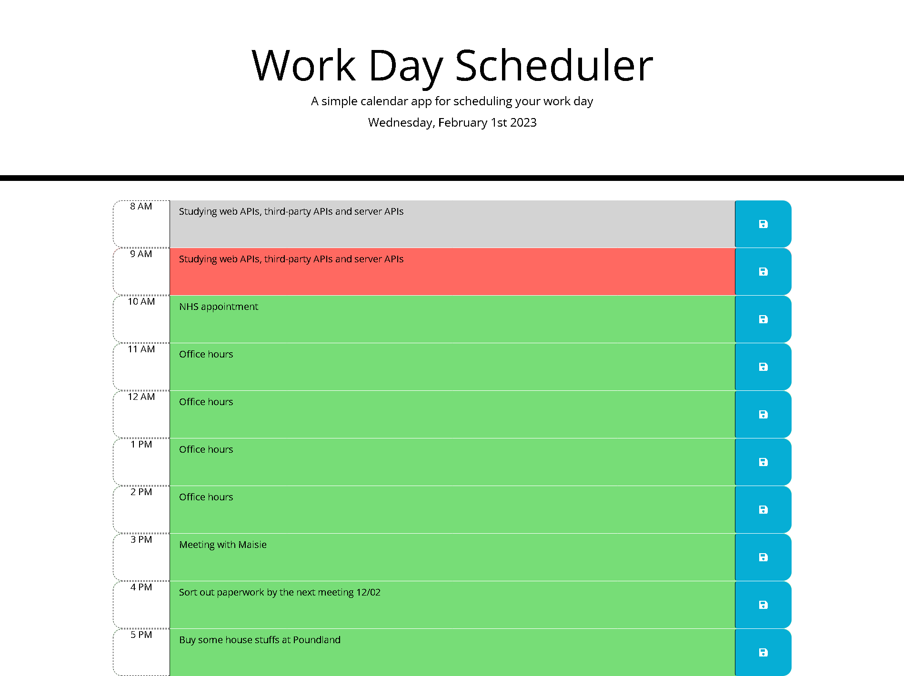

# Work Day Scheduler

## Description
This simple application allows a user to save events to a daily planner so that they can manage their time more effectively.

## Appearance
The app displays the current day at the top of the calendar, presents different color timeblocks based on past, present and future events, saves the event in local storage when the save button is clicked and loads events when the user refreshes the page.

## Things I learnt
Through the development of this project, I learned how to use Moment.js library to work with date and time, and jQuery localStorage method to save and load information to the user.

## Instructions
Enter an event and click on the save button. Your information will be saved even if you reload the page, throughout the day you will see the color change based on the current time. All data is cleared for the next day.

## Technologies Used
* HTML
* CSS
* JavaScript
* jQuery
* Moment.js

## Link to deployed application
[Work Day Scheduler](https://vanessadantonio.github.io/work-day-scheduler//)